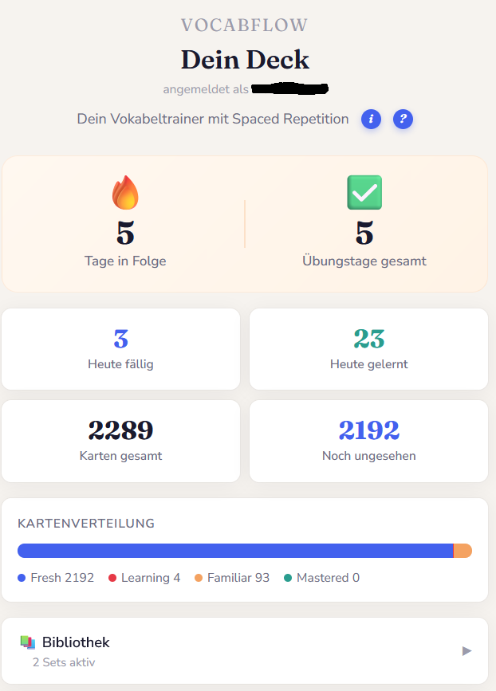
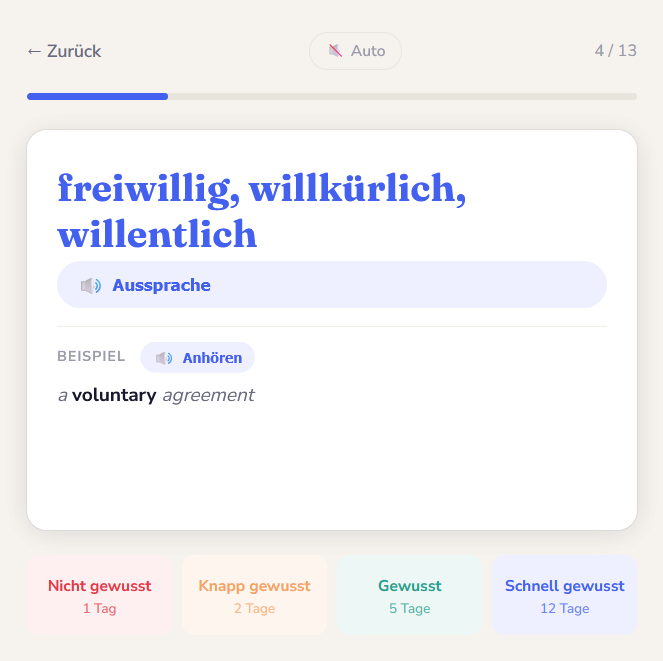
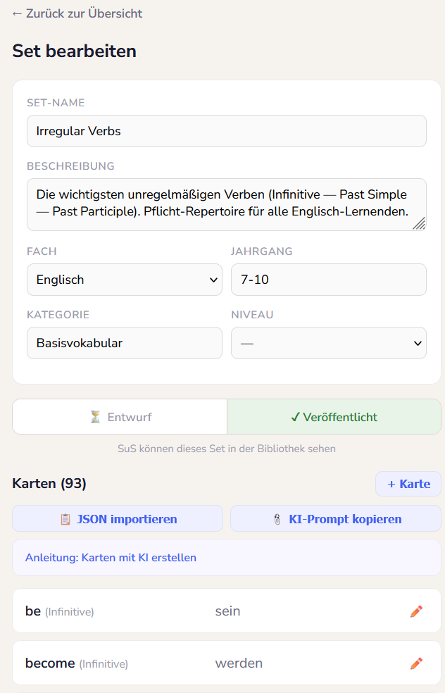
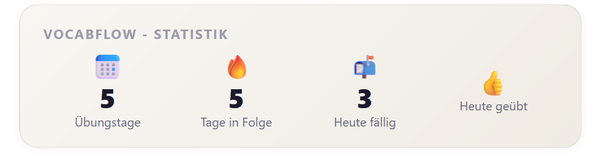
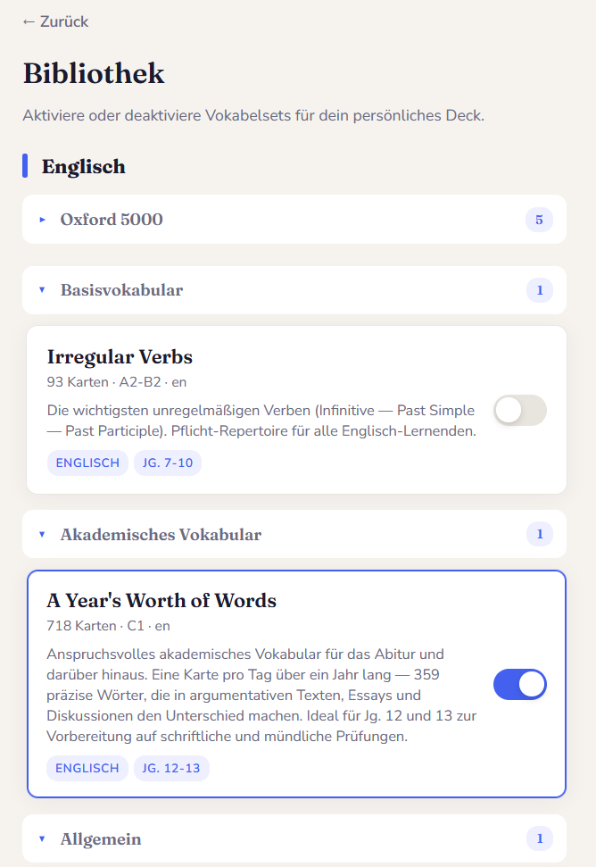

# VocabFlow

Ein Vokabeltrainer mit Spaced Repetition (FSRS), der als SCORM-Paket in Moodle eingebunden wird. Supabase als Backend. Entwickelt für den Schulalltag.

 

## Kurz

- **FSRS-Algorithmus** plant pro Karte individuell den optimalen Wiederholungszeitpunkt.
- **Keine eigene Auth** — Moodle liefert die Nutzeridentität über `M.cfg.userId`.
- **Lehrer-UI** zum Erstellen/Bearbeiten eigener Sets, inkl. KI-gestütztem JSON-Import.
- **Inhalte** (optional): Oxford 5000 (A1–C1), Irregular Verbs, Text Analysis Toolkit u.a.
- **Single-File-HTML** (~100 KB), kein Build-Step, ein:e Lehrer:in + KI-Assistent können es pflegen.

## Screenshots

> Bilder folgen. Sobald sie in `docs/screenshots/` liegen, rendern die Einbindungen unten automatisch.

  

| Lernansicht | Editor |
|---|---|
|  |  |

| Dashboard-Widget | Bibliothek |
|---|---|
|  |  |

## Repo-Inhalt

| Ordner | Inhalt |
|---|---|
| `app/` | `vocabflow.html` (Haupt-App) + SCORM-Manifest |
| `widget/` | Standalone + Moodle-Inline-Version des Dashboard-Stats-Widgets |
| `supabase/` | Schema-Migration + Edge-Function-Code (`vocab-write`, `set-manager`) |
| `Dokumentation/` | Vollständige Nachnutzungs-Doku (Konzept, Architektur, Setup, Sicherheit, Roadmap) |
| `examples/` | Beispiel-Set im JSON-Format |

## Loslegen

Komplette Setup-Anleitung: **[Dokumentation/06_Setup_Anleitung.md](Dokumentation/06_Setup_Anleitung.md)**.

Kurz:
1. Supabase-Projekt (EU) anlegen.
2. `supabase/migrations/001_schema.sql` im SQL-Editor ausführen.
3. Edge Functions `vocab-write` und `set-manager` deployen (`--no-verify-jwt`).
4. `app/vocabflow.html`: `<YOUR_SUPABASE_URL>` und `<YOUR_SUPABASE_ANON_KEY>` eintragen.
5. Als SCORM-ZIP bauen, in Moodle als SCORM-Aktivität einbinden.
6. Dich selbst per SQL in die `teachers`-Tabelle eintragen.

Mit KI-Assistent (Claude Code + Supabase MCP-Server) läuft das in ~1–2 Stunden.

## Status & Grenzen

Das Projekt ist **pragmatisch und schulspezifisch** gebaut, nicht für öffentlichen Massenbetrieb. Offene Sicherheitspunkte (Reads sind aktuell offen, kein Supabase-Auth) sind in [Dokumentation/07_Sicherheit_Datenschutz.md](Dokumentation/07_Sicherheit_Datenschutz.md) transparent gelistet.

## Mitwirken

Issues und Pull Requests sind willkommen. Siehe [CONTRIBUTING.md](CONTRIBUTING.md).

**Wichtig:** Keine realen Schülerdaten, Moodle-IDs oder Screenshots mit Klarnamen in Issues/PRs.

## Lizenz

MIT — siehe [LICENSE](LICENSE).

## Kontakt

Malte Ohlsen — `malte.ohlsen@igs-seevetal.de`

Rückmeldungen zu Erfahrungen, Erweiterungen und DSGVO-Bewertungen sind willkommen.
